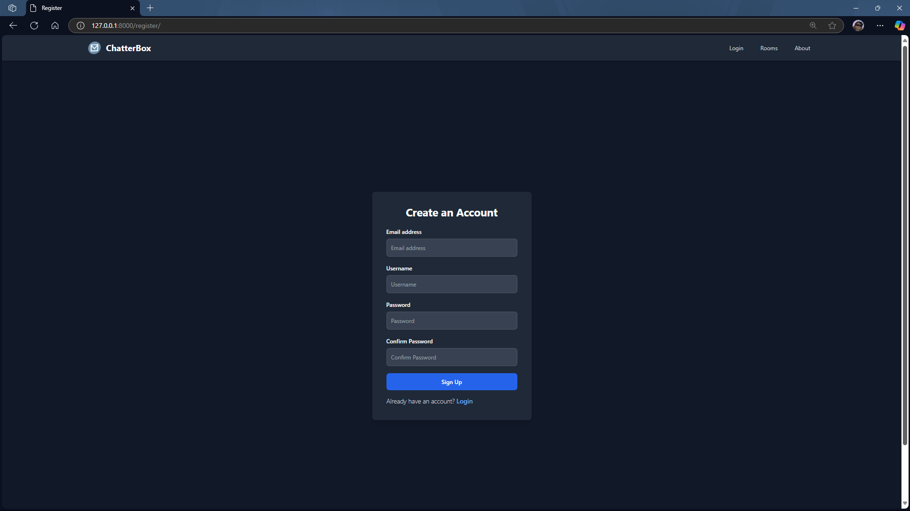
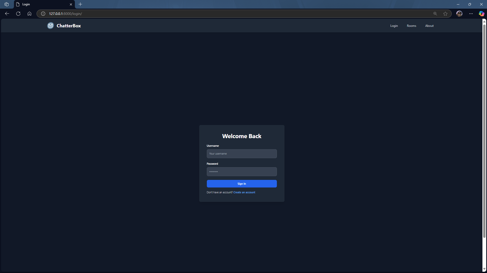
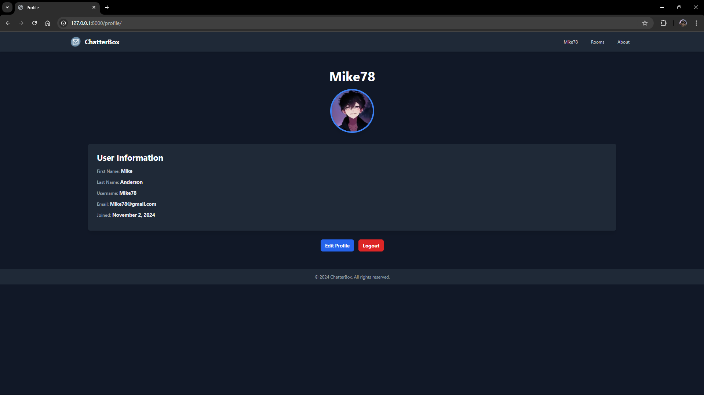
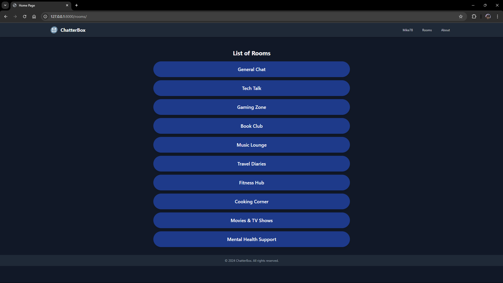
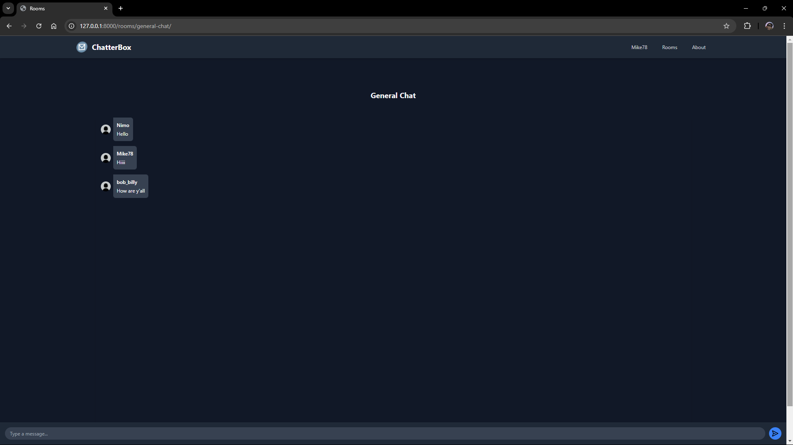

# Chatterbox - Real-Time Chat Application

  

## Description

Chatterbox is a real-time chat application built using Django, Django Channels, and WebSockets. This application allows users to register, log in, and engage in real-time messaging through various chat rooms. The application features a modern design using Tailwind CSS for an enhanced user experience.

## Features

- **User Registration and Authentication**: Users can create accounts, log in, and log out securely.
- **Real-Time Messaging**: Utilizes Django Channels and WebSockets for real-time communication between users.
- **Dynamic Chat Rooms**: Users can join multiple chat rooms and send messages instantly.
- **Profile Management**: Users can view and edit their profiles, including profile pictures.
- **Responsive Design**: Built with Tailwind CSS, the application is fully responsive and works seamlessly on various devices.

## Technologies Used

- **Backend**: 
  - Django
  - Django Channels
  - WebSockets
- **Frontend**: 
  - HTML
  - Tailwind CSS
  - JavaScript
- **Version Control**: Git & GitHub

## Screenshots

- **Registration Page**
  
  

- **Login Page**
  
  

- **Profile Page**
  
  
  
- **Home Page**
  
  
  
- **Chat Room**
  
  

## Usage
- **Register**: Create a new account through the registration page.
- **Login**: Use your credentials to log in.
- **Join Chat Rooms**: Once logged in, you can join available chat rooms.
- **Send Messages**: Type and send messages in real-time with other users.
- **Manage Profile**: View and edit your profile information.


## Installation

To set up the project locally, follow these steps:

1. **Clone the repository**:
   ```bash
   git clone https://github.com/AdityaGarasangi/ChatterBox.git
   cd ChatterBox
   ```

2. **Create a virtual environment**:
   ```bash
   python -m venv env
   source venv/bin/activate  # On Windows use `venv\Scripts\activate`
   ```

3. **Install dependencies**:
    ```bash
    pip install -r requirements.txt
    ```

4. **Run database migrations**:
    ```bash
    python manage.py migrate
    ```

6. **Run the development server**:
     ```bash
     python manage.py runserver
     ```

8. Access the application: Open your browser and go to ``` http://127.0.0.1:8000/register ```  
